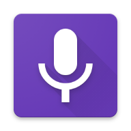
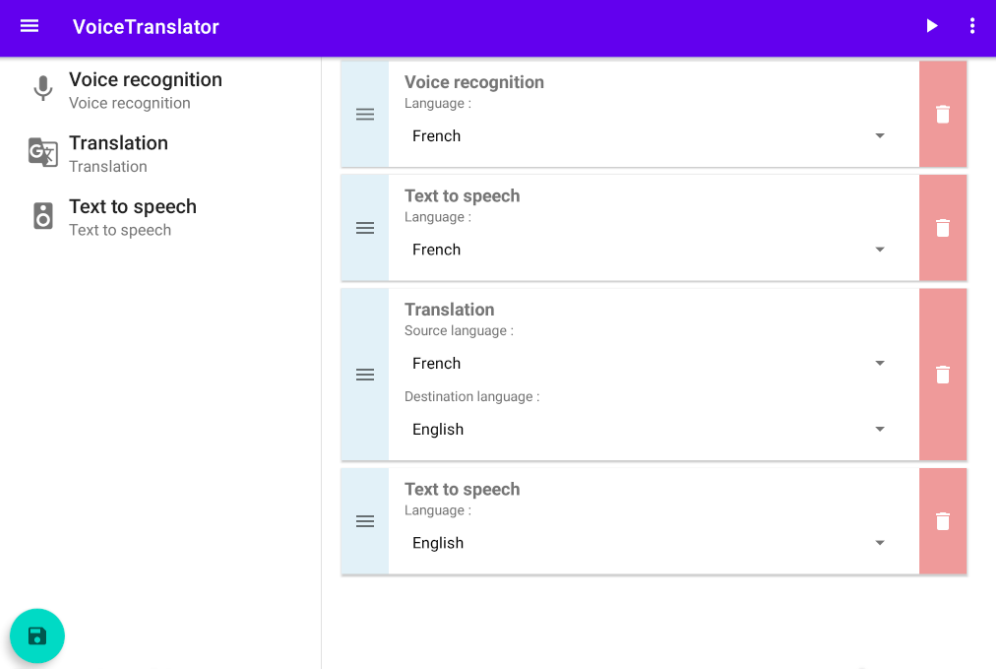

 

VoiceTranslator
===============

VoiceTranslator is an Android application that allows you to translate an audio message in one language into another language.

**The application requires Google Play Services** 

 

The script in this screenshot do four steps :
- listen to the user speak French
- voice synthesis repeating what the user has just said
- translation french -> english
- voice synthesis with the message translated into English

## Features

- ✅ Block scripting systems
- ✅ Three types of blocks
    - Voice recognition
    - Text to speech
    - Translation
- ✅ Save and load scripts
- ✅ Favorite/History system
- ✅ Two layouts : one for smartphones, the other for tablets

## Contributors

<table>
  <tr>
    <td align="center"><a href="https://github.com/Ellmanc"> <b>ELLMANN Célia</b></a></td>
    <td align="center"><a href="https://github.com/cforgeard"> <b>FORGEARD Clément</b></a></td>
  </tr>
</table>
